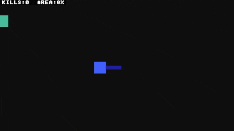

# Paper PSP


[](https://github.com/jeromeberg/paper-psp/releases/latest)


> ℹ️ Check out my [Awesome PSP]([https](https://github.com/jeromeberg/awesome-psp)) list of modding resources for PSP.

A singleplayer Paper.io clone for PSP, written in C with SDL2 and PSPSDK.

Claim area by enclosing space on the map and compete with bots for territory. Cut through an opponent's trail to eliminate them. Cross your own trail or hit the border and you die.

## Demo



## Installation

Download the [latest release](https://github.com/jeromeberg/paper-psp/releases/latest) and extract it into `/PSP/GAME/`.

## Build

### Prerequisites

- pspsdk
- psp-gcc
- psp-config
- SDL2

The easiest way is to install [pspdev](https://github.com/pspdev/pspdev), which includes everything needed.

### Instructions

```sh
make         # build
make re      # rebuild
make clean   # clean
```
